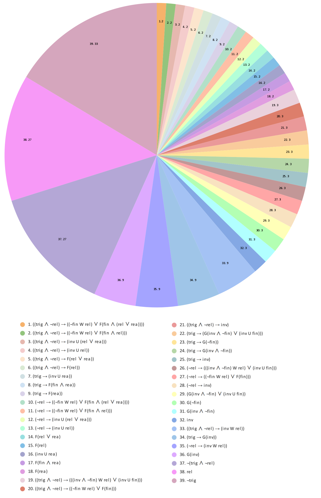

# Translator-EDTL-LTL

The algorithm which reduces the complex LTL-semantics formula of EDTL-requirements to LTL-formulas which cannot be reduced further by LTL simplification rules. Our algorithm takes as the input values of all EDTL-attributes, which can be identically true, identically false, or variable. The output of the algorithm is the reduced LTL-semantics formula for the EDTL-requirement with these input attribute values. Informally, the algorithm substitutes the input attribute values into the main EDTL-semantics formula and then simplifies this formula using standard and specially developed LTL simplification rules. This simplification non-recursively goes step by step from the semantic formula inside using simplified subformulas for simplification their supraformulas.

The classification uses the proposed algorithm for simplifying formulas. EDTL requirements belong to the same class if the result of the algorithm is the same formula up to the values of non-constant attributes.

